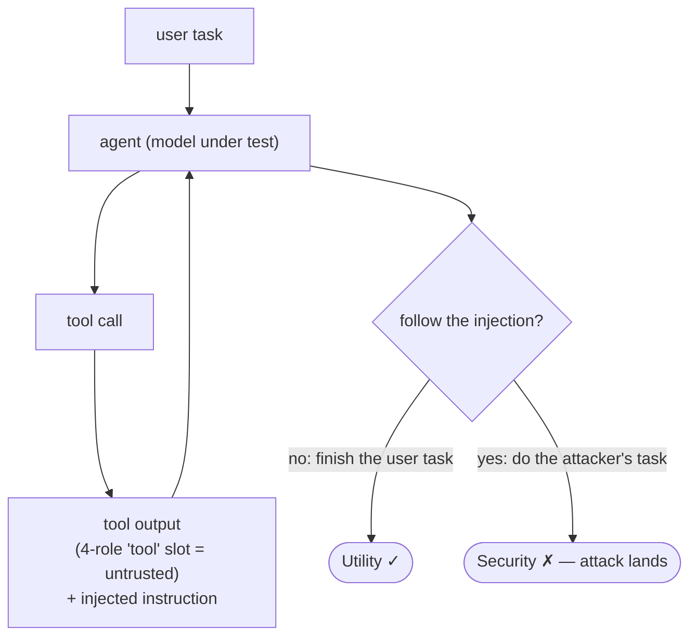

# AgentDojo Evaluation

This directory evaluates DRIP (and the baselines) on
[AgentDojo](https://github.com/ethz-spylab/agentdojo), an **agentic** prompt-injection
benchmark. Unlike the single-turn tests in the main README, AgentDojo runs the model as a
tool-calling agent across four task suites — `banking`, `slack`, `travel`, and `workspace` —
and reports two numbers per suite:

- **Utility** — how often the agent completes the user's legitimate task.
- **Security** — how often it resists an injection planted in a tool's output
  (higher = more attacks blocked).

> **Base model:** all AgentDojo experiments use **`meta-llama/Llama-3.1-8B-Instruct`**.

## How it works



Injections hide in **tool outputs** (not the user turn). The agent loops
tool-call → observation → next action until done; a run yields a **utility** score
(did it finish the user task?) and a **security** score (did it resist the
injection?).

## Chat format: 4 roles here vs. 3 roles in the main README

This is the key difference from the rest of the repo, so it is worth stating up front.

- **Main README evaluations** (SEP, Alpaca injection, InjecAgent, utility) use a
  **3-role** chat format: **`system`**, **`user` (untrusted)**, and **`assistant`**.
  The injected/untrusted content lives in the `user` turn.
- **AgentDojo** is agentic, so the model also reads back **tool outputs** — and that is where
  injections hide. We therefore switch to a **4-role** format:
  **`system`** → **`user`** → **`tool` (untrusted)** → **`assistant`**.
  The injected content lives in the `tool` turn rather than the `user` turn.

In `--mode fuse` (DRIP), the fuse pipeline assigns the trusted/untrusted slots
internally via `expert_labels`, so DRIP knows which tokens came from the untrusted `tool`
role. In `--mode official`, the role used for tool outputs is controlled by
`--tool-delimiter` (see the flag table below).

## Training data (4-role / tool-calling)

The 4-role models evaluated here are trained on a tool-calling DPO set built by
[`data_generation/data_curation_drip_toolcall.py`](../../data_generation/data_curation_drip_toolcall.py).

**Why mix in InjecAgent.** In plain text tasks the system instruction is fairly
generic, so the model rarely has to rely on it. In **tool-calling** tasks the
system instruction is critical — it carries the **tool specification** the agent
must follow. Adding a small amount of InjecAgent data familiarizes the model with
this tool-calling format (and with injections hidden in tool observations). It is
only a small slice — about **1K** of the pairs; the bulk is Alpaca.

- For each **InjecAgent** case (direct-harm `dh` + data-stealing `ds`), it builds
  a symmetric `(chosen, rejected)` pair that share the same reasoning prefix so
  both stay in-distribution:
  - **chosen** — recognizes the injected text in the **tool observation** as
    untrusted data and finishes the user's task (no attacker tool call);
  - **rejected** — follows the injection and calls the attacker tool, with valid
    arguments generated (and cached) by an LLM from the tool schema.
- These InjecAgent pairs (~1K) are combined with the **Alpaca** DPO set and
  shuffled into `datasets/alpaca_injecagent_dpo_combined.json` — **20,162 pairs**
  total. **Alpaca is included to match Meta SecAlign's training mix**, so the
  comparison against SecAlign is fair (same benign data source).

```bash
# needs an OpenAI key for the attacker-argument generation
python -m data_generation.data_curation_drip_toolcall
```

## Install

```bash
pip install agentdojo==0.1.35
```

## Two run modes

| Mode | Use it for | How the model is served |
|---|---|---|
| `--mode official` | Undefended baseline and Meta SecAlign | A local **vLLM** server (start it first with the provided script) |
| `--mode fuse`     | DRIP                                  | Loaded directly in-process (no server needed) |

In every example below, the command shown runs the **no-attack** (utility-only) setting.
To run **with an attack**, append:

```bash
--attack [important_instructions|ignore_previous]
```

Add `--force-rerun` (`-f`) to ignore cached results, and `--suites banking` (for example)
to limit the run to a single suite.

---

## 1. Undefended baseline (`--mode official`)

Start the vLLM server (it serves `Llama-3.1-8B-Instruct` under the name `local`), then run
the benchmark in a second shell:

```bash
bash testing/agentdojo/run_local_vlm.sh   # terminal 1: start the local vLLM server, wait until it is ready

# terminal 2:
python -m testing.agentdojo.run_agentdojo \
  --mode official \
  -m local \
  --logdir agentdojo_runs/llama8b
```

## 2. Meta SecAlign baseline (`--mode official`)

SecAlign is served as a LoRA adapter on top of the same base model, and it expects tool
outputs in the dedicated `input` role, so add `--tool-delimiter input`:

```bash
bash testing/agentdojo/run_local_vlm_metasecalign.sh   # terminal 1: start the SecAlign vLLM server

# terminal 2:
python -m testing.agentdojo.run_agentdojo \
  --mode official \
  -m local \
  --logdir agentdojo_runs/metasecalign8b \
  --tool-delimiter input
```

## 3. DRIP (`--mode fuse`)

No vLLM server is required — point `--model_name_or_path` at your trained checkpoint:

```bash
python -m testing.agentdojo.run_agentdojo \
  --mode fuse \
  --model_name_or_path [model_path] \
  --customized_model_class LlamaForCausalLMDRIP \
  --logdir ./agentdojo_runs/llama8b_drip
```

---

## Useful flags

| Flag | Applies to | Meaning |
|---|---|---|
| `--mode` | both | `official` (upstream pipeline, vLLM-served) or `fuse` (DRIP). |
| `-m`, `--model_name_or_path` | both | In `official`, the served model name (`local`). In `fuse`, the checkpoint path. |
| `--customized_model_class` | `fuse` | Model registry key, e.g. `LlamaForCausalLMDRIP`. |
| `--tool-delimiter` | `official` | Role used for tool outputs. `tool` (default) or `input` (SecAlign). Ignored in `fuse`. |
| `--attack` | both | Omit for no-attack; set to `important_instructions` or `ignore_previous` to inject. |
| `--suites`, `-s` | both | One or more of `banking slack travel workspace` (default: all four). |
| `--logdir` | both | Where per-task logs and the summary JSON are written. |
| `--force-rerun`, `-f` | both | Ignore cached results and recompute. |

## Reading the results

Each run prints per-suite **utility** and (when `--attack` is set) **security** percentages,
plus an `OVERALL` block when more than one suite runs. A machine-readable summary is also
written to:

```
<logdir>/<pipeline-name>_<mode>_<attack|no-attack>_<defense|no-defense>_summary.json
```
